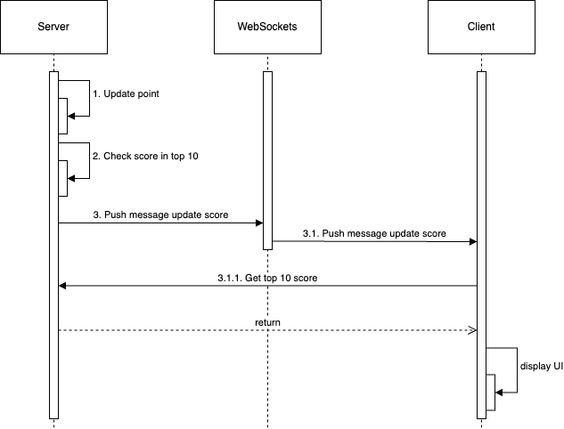
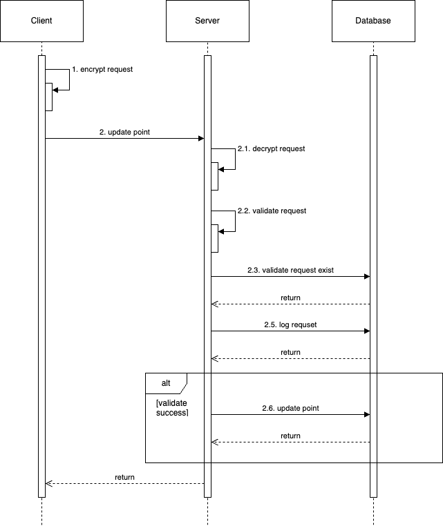

# Objective

- Users can track the leaderboard of the top 10.
- User can do an action, completing this action will increase the user’s point.
- Display the leaderboard in real-time.
- It's necessary to prevent malicious users from increasing point without authorisation.

# Background

- There is a UI and API to display the top 10 users with the highest scores.
- There is a UI and API for users to perform actions and earn points.

# Design Proposal

## 1. Update score board

- Use WebSockets to send message to the client whenever a user's score is updated.
- Only send message when the user's new score places them in the top 10.

## 2. Update point

- Always authenticate the user when the client makes a request to the server. (JWT, OAuth,...)
- Currently, after the user completes an action, the client will call the API to increase the user's points.
- The client encrypts the request before calling the server. (HMAC,...)
- The server decrypts the request and authenticates it before awarding points.
- Keep a log of the request and make sure no request is handled again after points have been incremented.

